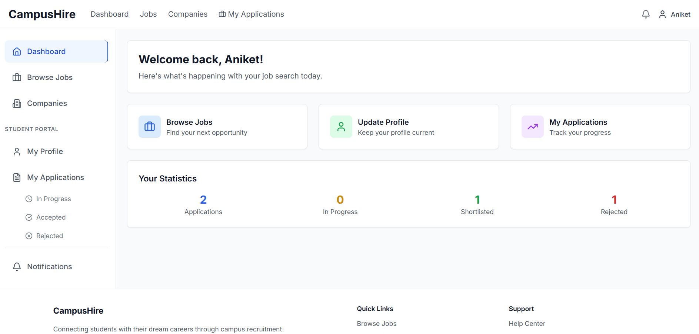
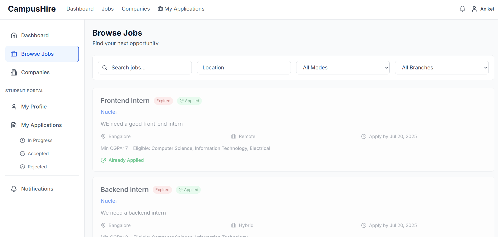
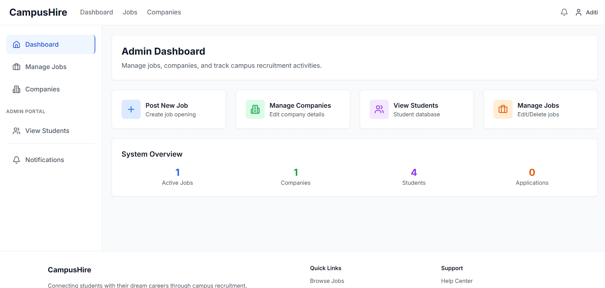
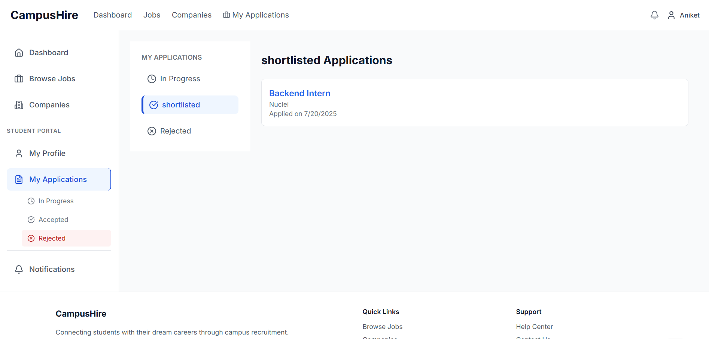
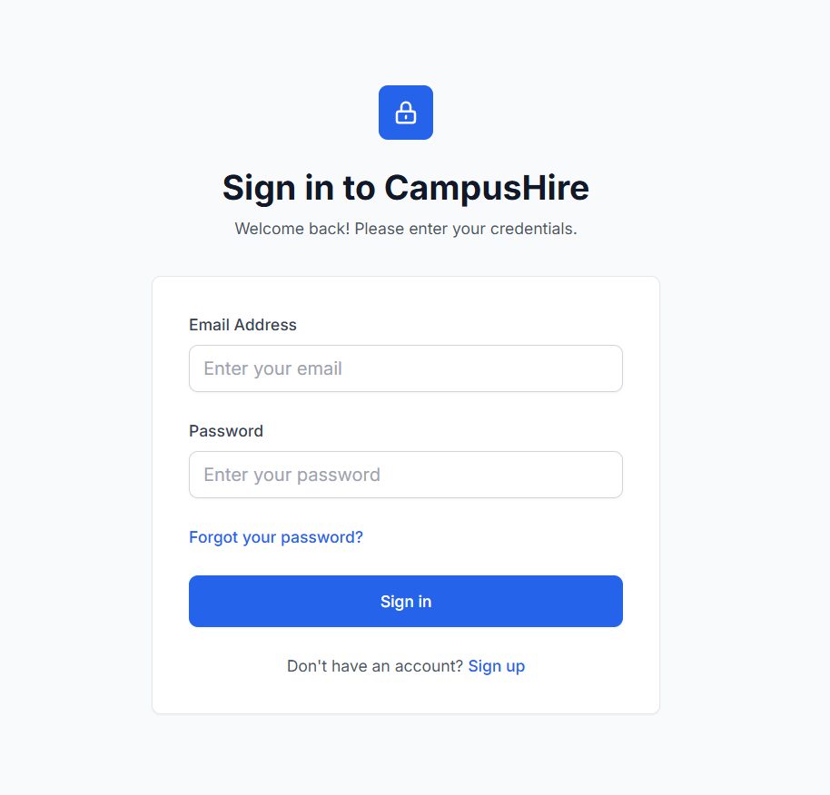

# CampusHire 🎓

**A comprehensive campus recruitment platform connecting students with their dream careers through seamless recruitment processes.**

## 🌐 Live Demo
🔗 **[View Live Application](https://campus-hire-omega.vercel.app/)**

## ✨ Features

### 👨‍🎓 For Students
- **Profile Management**: Create and maintain detailed student profiles
- **Job Discovery**: Browse and search through available job opportunities
- **Application Tracking**: Track application status in real-time
- **Company Insights**: View detailed company profiles and job requirements
- **Notifications**: Real-time updates on application status
- **Dashboard**: Personalized dashboard with relevant insights

### 🏢 For Companies/Admins
- **Job Posting**: Create and manage job listings
- **Application Management**: Review and manage student applications
- **Student Discovery**: Browse student profiles and identify potential candidates
- **Analytics Dashboard**: Track recruitment metrics and performance
- **Notification System**: Stay updated on new applications and activities

### 🔐 Authentication & Security
- **Secure Authentication**: NextAuth.js integration with role-based access
- **Password Recovery**: OTP-based forgot password functionality with email integration
- **Role Management**: Separate interfaces for students and administrators
- **Data Protection**: Secure handling of sensitive user information

## 🚀 Tech Stack

### Frontend
- **Framework**: [Next.js 15](https://nextjs.org/) with TypeScript
- **Styling**: [Tailwind CSS](https://tailwindcss.com/) with shadcn/ui components
- **State Management**: React hooks and context
- **Form Handling**: React Hook Form with Zod validation
- **Icons**: Lucide React
- **Calendar**: React Big Calendar for scheduling

### Backend
- **API**: Next.js API Routes
- **Database**: [MongoDB](https://mongodb.com/) with Mongoose ODM
- **Authentication**: [NextAuth.js](https://next-auth.js.org/)
- **Email Service**: [Resend](https://resend.com/) for transactional emails
- **File Upload**: Formidable for handling file uploads

### Development Tools
- **Package Manager**: npm
- **Linting**: ESLint with Next.js config
- **Type Checking**: TypeScript
- **Build Tool**: Turbopack (Next.js 15)

## 📁 Project Structure

```
CampusHire/
├── 📁 src/
│   ├── 📁 app/
│   │   ├── 📁 (auth)/           # Authentication pages (sign-in, sign-up, etc.)
│   │   ├── 📁 admin/            # Admin dashboard and management
│   │   ├── 📁 api/              # API routes
│   │   │   ├── 📁 auth/         # Authentication endpoints
│   │   │   ├── 📁 jobs/         # Job-related APIs
│   │   │   ├── 📁 applications/ # Application management APIs
│   │   │   ├── 📁 students/     # Student-related APIs
│   │   │   └── 📁 companies/    # Company management APIs
│   │   ├── 📁 student/          # Student dashboard and features
│   │   ├── 📁 jobs/             # Job listings and details
│   │   ├── 📁 companies/        # Company profiles
│   │   └── 📁 dashboard/        # Main dashboard
│   ├── 📁 components/           # Reusable React components
│   ├── 📁 model/                # MongoDB schemas
│   │   ├── User.ts              # User model with authentication
│   │   ├── Job.ts               # Job postings model
│   │   ├── Application.ts       # Application tracking model
│   │   ├── StudentProfile.ts    # Student profile model
│   │   └── CompanyProfile.ts    # Company profile model
│   ├── 📁 lib/                  # Utility functions and configurations
│   ├── 📁 helpers/              # Helper functions (email, validation, etc.)
│   ├── 📁 schemas/              # Zod validation schemas
│   └── 📁 types/                # TypeScript type definitions
├── 📁 emails/                   # Email templates
├── 📁 public/                   # Static assets
└── 📁 docs/                     # Documentation and screenshots
```

## 🛠️ Installation & Setup

### Prerequisites
- Node.js (v18 or higher)
- MongoDB database
- Resend account (for email functionality)

### 1. Clone the Repository
```bash
git clone https://github.com/Aniket-Sahu/CampusHire.git
cd CampusHire
```

### 2. Install Dependencies
```bash
npm install
```

### 3. Environment Configuration
Create a `.env.local` file in the root directory:

```env
# Database
MONGODB_URI=your_mongodb_connection_string

# NextAuth Configuration
NEXTAUTH_SECRET=your_nextauth_secret
NEXTAUTH_URL=http://localhost:3000

# Email Service (Resend)
RESEND_API_KEY=your_resend_api_key

# Application Settings
NODE_ENV=development
```

### 4. Set Up Email Service
1. Create a [Resend](https://resend.com) account
2. Obtain your API key from the Resend dashboard
3. Add the API key to your `.env.local` file
4. (Optional) Verify a custom domain for production use

### 5. Database Setup
1. Set up a MongoDB database (local or cloud-based like MongoDB Atlas)
2. Add your MongoDB connection string to the `.env.local` file
3. The application will automatically create the necessary collections

### 6. Run the Development Server
```bash
npm run dev
```

Open [http://localhost:3000](http://localhost:3000) to view the application.

## 📊 Database Models

### User Model
```typescript
interface IUser {
  _id: Types.ObjectId;
  name: string;
  email: string;
  password: string;
  role: "student" | "admin";
  forgotPassCode?: string;
  forgotPassCodeExpiry?: Date;
  createdAt: Date;
  updatedAt: Date;
}
```

### Student Profile
```typescript
interface IStudentProfile {
  _id: Types.ObjectId;
  userId: Types.ObjectId; // Reference to User
  personalInfo: {
    phone: string;
    address: string;
    dateOfBirth: Date;
  };
  academicDetails: {
    college: string;
    course: string;
    year: number;
    cgpa: number;
  };
  skills: string[];
  experience: string;
  resume?: string; // File path or URL
  createdAt: Date;
  updatedAt: Date;
}
```

### Company Profile
```typescript
interface ICompanyProfile {
  _id: Types.ObjectId;
  userId: Types.ObjectId; // Reference to User (admin)
  companyName: string;
  description: string;
  industry: string;
  website: string;
  contactInfo: {
    email: string;
    phone: string;
    address: string;
  };
  logo?: string;
  createdAt: Date;
  updatedAt: Date;
}
```

### Job Model
```typescript
interface IJob {
  _id: Types.ObjectId;
  companyId: Types.ObjectId; // Reference to CompanyProfile
  title: string;
  description: string;
  requirements: string[];
  location: string;
  salary?: {
    min: number;
    max: number;
    currency: string;
  };
  jobType: "full-time" | "part-time" | "internship";
  applicationDeadline: Date;
  isActive: boolean;
  createdAt: Date;
  updatedAt: Date;
}
```

### Application Model
```typescript
interface IUser {
  _id: Types.ObjectId;
  name: string;
  email: string;
  password: string;
  role: "student" | "admin";
  forgotPassCode?: string;
  forgotPassCodeExpiry?: Date;
  createdAt: Date;
  updatedAt: Date;
}
```

## 🔐 Authentication Flow

1. **Registration**: Students and admins can create accounts with email verification
2. **Login**: Secure login with password hashing
3. **Password Recovery**: OTP-based password reset via email[1]
4. **Session Management**: NextAuth.js handles secure session management
5. **Role-based Access**: Different interfaces for students and administrators

## 📧 Email Integration

The application uses Resend for transactional emails:
- **Password Reset**: OTP-based password recovery
- **Application Updates**: Notifications for application status changes
- **Welcome Emails**: User onboarding emails

### Email Templates
Located in the `emails/` directory with React-based templates using `@react-email/components`[1].

## 🚀 Deployment

### Vercel (Recommended)
1. Connect your GitHub repository to Vercel
2. Set up environment variables in Vercel dashboard
3. Deploy automatically on every push to main branch

### Manual Deployment
```bash
# Build the application
npm run build

# Start the production server
npm start
```

## 🤝 Contributing

We welcome contributions! Please follow these steps:

1. **Fork the Repository**
2. **Create a Feature Branch**
   ```bash
   git checkout -b feature/your-feature-name
   ```
3. **Make Changes** and commit them
   ```bash
   git commit -m "Add your feature description"
   ```
4. **Push to Your Fork**
   ```bash
   git push origin feature/your-feature-name
   ```
5. **Create a Pull Request**

### Development Guidelines
- Follow the existing code style and structure
- Write descriptive commit messages
- Test your changes thoroughly
- Update documentation as needed

## 📸 Screenshots

### Student Dashboard

*The main student dashboard showing job recommendations and application status*

### Job Listings

*Browse and search through available job opportunities*

### Admin Panel

*Administrative interface for managing jobs and applications*

### Application Management

*Track and manage student applications efficiently*

### Authentication Flow

*Secure login interface with forgot password option*


*OTP verification page for password recovery*

## 🔧 Available Scripts

```bash
# Development server with Turbopack
npm run dev

# Production build
npm run build

# Start production server
npm start

# Run linting
npm run lint
```

## 📱 Features in Development

- [ ] Mobile application
- [ ] Advanced search filters
- [ ] Analytics dashboard enhancements

## 🐛 Known Issues & Troubleshooting

### Email Delivery Issues
- Ensure your Resend API key is valid
- For production, verify your domain in Resend
- Check spam folders for development emails[1]

### Database Connection
- Verify MongoDB connection string
- Ensure MongoDB service is running
- Check network connectivity for cloud databases

### Authentication Problems
- Verify NEXTAUTH_SECRET is set
- Check NEXTAUTH_URL matches your deployment URL
- Ensure all required environment variables are configured

## 📊 Project Statistics

- **Languages**: TypeScript (99.8%), Other (0.2%)[1]
- **Contributors**: 3 active contributors[1]
- **Last Updated**: Recently active with regular commits[1]

## 📄 License

This project is currently under development. Please contact the contributors for licensing information.

## 🙋‍♂️ Support

For support, questions, or feature requests:
- **Create an Issue**: Use GitHub issues for bug reports
- **Discussions**: Use GitHub discussions for questions
- **Contact**: Reach out to the maintainers directly

## 🌟 Acknowledgments

- Built with [Next.js](https://nextjs.org/) and modern React patterns
- UI components from [shadcn/ui](https://ui.shadcn.com/)
- Email service provided by [Resend](https://resend.com/)
- Database powered by [MongoDB](https://mongodb.com/)

**CampusHire** - *Connecting talent with opportunity* 🎓✨

Made with ❤️ by [Aniket Sahu](https://github.com/Aniket-Sahu), [Naman Dubey](https://github.com/namandubey-0209), and contributors.
